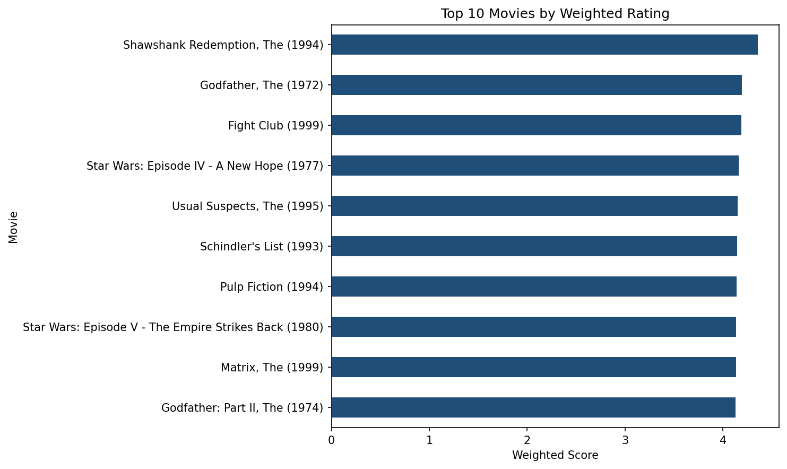

# DSA 4060 – Recommender Systems
## Week 1 Practical: Popularity-Based Movie Recommender

## 1. Project Overview

This repository contains my Week 1 practical for DSA 4060 – Recommender Systems.

The purpose of the practical is to explore user-item interaction data and build a simple non-personalized movie recommender using the MovieLens Latest Small dataset.

The project starts with exploratory analysis of the movies and ratings datasets before implementing two recommendation approaches:

1. A popularity recommender based on a minimum number of ratings.
2. A weighted-rating recommender that considers both average rating and the amount of rating evidence available.

The project also investigates how different rating thresholds affect the recommendations and includes a simple genre-based extension.

This popularity-based system provides a useful baseline that can later be compared with more advanced personalized recommender systems such as collaborative filtering, content-based filtering, and hybrid recommendation approaches.

---

## 2. Objectives

The main objectives of this practical are to:

- Load and inspect the MovieLens movies and ratings datasets.
- Validate the datasets before analysis.
- Explore user-movie rating interactions.
- Measure the sparsity of the user-item interaction space.
- Identify the most frequently rated movies.
- Investigate the limitations of ranking movies using average rating alone.
- Build a popularity-based recommender using a minimum-rating threshold.
- Implement a weighted-rating approach.
- Compare the two recommendation approaches.
- Test how different parameter choices affect the recommendations.
- Visualize the final weighted recommendations.
- Discuss the limitations of popularity-based recommendation systems.

---

## 3. Dataset

The project uses the **MovieLens Latest Small** dataset provided by GroupLens Research.

Two main files are used in the analysis:

### `movies.csv`

This file contains information about the movies.

The main columns are:

- `movieId` – unique identifier for each movie.
- `title` – movie title and release year.
- `genres` – one or more genres associated with the movie.

### `ratings.csv`

This file contains user-movie rating interactions.

The main columns are:

- `userId` – unique identifier for each user.
- `movieId` – identifier of the rated movie.
- `rating` – rating given by the user.
- `timestamp` – time at which the rating was recorded.

---

## 4. Dataset Summary

Initial exploration produced the following results:

| Metric | Result |
|---|---:|
| Movies in `movies.csv` | 9,742 |
| Users | 610 |
| Rating interactions | 100,836 |
| Movies with at least one rating | 9,724 |
| Movies without ratings | 18 |
| Minimum rating | 0.5 |
| Maximum rating | 5.0 |
| Mean rating | 3.502 |
| Median rating | 3.5 |

The validation process found:

- No missing values in `movies.csv`.
- No missing values in `ratings.csv`.
- No duplicate movie rows.
- No duplicate rating rows.
- No unknown movie IDs in the ratings dataset.

Therefore, no rows needed to be removed before continuing with the analysis.

---

## 5. Exploratory Analysis

### 5.1 User Rating Activity

The dataset contains 610 users.

The number of ratings submitted by users varies considerably:

- Average ratings per user: approximately 165
- Median ratings per user: approximately 71
- Minimum ratings by a user: 20
- Maximum ratings by a user: 2,698

This indicates that some users are much more active than others.

### 5.2 Movie Rating Activity

Movie rating activity is also highly uneven.

The average movie has approximately 10 ratings, while the median movie has only 3 ratings.

At least 25% of rated movies have received only one rating, while the most frequently rated movie has 329 ratings.

This means that rating activity is concentrated around a relatively small group of movies.

### 5.3 Rating Distribution

The most common rating in the dataset is **4.0**, with 26,818 occurrences.

It is followed by:

- 3.0 – 20,047 ratings
- 5.0 – 13,211 ratings
- 3.5 – 13,136 ratings
- 4.5 – 8,551 ratings

Lower ratings such as 0.5, 1.0, and 1.5 occur less frequently.

Overall, users in this dataset gave ratings between 3.0 and 5.0 more frequently than the lowest rating values.

---

## 6. Interaction Sparsity

The dataset contains:

- 610 users
- 9,724 rated movies
- 100,836 observed rating interactions

The total number of possible user-movie interactions is:

**5,931,640**

Only 100,836 of these interactions are observed.

This results in an interaction sparsity of approximately:

**98.30%**

This means that most possible user-movie combinations have no recorded rating.

High sparsity is an important issue in recommender systems because information about user preferences is available for only a small portion of the complete user-item space.

---

## 7. Most-Rated Movies

Movies were first ranked according to the number of ratings received.

The most-rated movie was:

**Forrest Gump (1994)**

- Rating count: 329
- Average rating: approximately 4.164

The next highly rated-by-volume movies included:

- The Shawshank Redemption
- Pulp Fiction
- The Silence of the Lambs
- The Matrix
- Star Wars: Episode IV – A New Hope
- Jurassic Park
- Braveheart
- Terminator 2: Judgment Day
- Schindler's List

Rating count is useful as an indicator of movie visibility and engagement. However, it does not necessarily indicate that a movie has the highest average rating.

For example, Forrest Gump received the largest number of ratings, while The Shawshank Redemption had a higher average rating.

---

## 8. Problem With Average Rating Alone

The movies were also ranked purely by their average rating.

This produced several movies with a perfect average rating of **5.0**.

However, the movies at the top of this ranking had received only one or two ratings.

Examples included:

- Lamerica – 2 ratings
- Heidi Fleiss: Hollywood Madam – 2 ratings
- Lesson Faust – 2 ratings
- A Awfully Big Adventure – 1 rating
- Live Nude Girls – 1 rating

This demonstrates an important weakness of using average rating alone.

A movie rated 5.0 by one user would rank above a movie rated 4.4 by hundreds of users, even though the second movie has considerably more rating evidence.

For this reason, rating count needs to be considered when constructing a more reliable popularity-based recommendation system.

---

## 9. Minimum-Rating Popularity Recommender

The first recommendation method addresses the problem above by requiring movies to have a minimum number of ratings before they can qualify.

For the main experiment, the minimum threshold was set to:

**50 ratings**

After applying this threshold, qualifying movies were ranked by their average rating.

### Top 10 – Minimum 50 Ratings

| Rank | Movie | Rating Count | Average Rating |
|---:|---|---:|---:|
| 1 | The Shawshank Redemption (1994) | 317 | 4.429 |
| 2 | The Godfather (1972) | 192 | 4.289 |
| 3 | Fight Club (1999) | 218 | 4.273 |
| 4 | Cool Hand Luke (1967) | 57 | 4.272 |
| 5 | Dr. Strangelove | 97 | 4.268 |
| 6 | Rear Window (1954) | 84 | 4.262 |
| 7 | The Godfather: Part II (1974) | 129 | 4.260 |
| 8 | The Departed (2006) | 107 | 4.252 |
| 9 | Goodfellas (1990) | 126 | 4.250 |
| 10 | Casablanca (1942) | 100 | 4.240 |

The Shawshank Redemption ranks first after the minimum-rating requirement is applied.

Unlike ranking by average rating alone, every movie in this list has ratings from at least 50 users.

---

## 10. Popularity Recommender Function

The minimum-rating approach was converted into a reusable Python function.

The function accepts:

- `stats` – aggregated movie statistics.
- `min_ratings` – minimum number of ratings required.
- `top_n` – number of recommendations to return.

This makes it possible to test different thresholds without rewriting the recommendation logic.

For example:

```python
recommend_popular_movies(
    movie_stats,
    min_ratings=50,
    top_n=10
)
```

---

## 11. Weighted-Rating Recommender

A second recommendation method was implemented using a weighted-rating approach.

Instead of relying only on a fixed minimum threshold, the weighted method combines:

- The movie's average rating.
- The movie's rating count.
- The overall mean rating.
- A minimum evidence threshold.

The formula used is:

**Weighted Score = (v / (v + m)) × R + (m / (v + m)) × C**

Where:

- `R` = average rating of the movie
- `v` = number of ratings for the movie
- `C` = overall average rating
- `m` = minimum evidence threshold

For this dataset:

- `C` = approximately **3.502**
- `m` = **27 ratings**, based on the 90th percentile of rating counts

The purpose of the weighted score is to prevent movies with limited rating evidence from receiving excessively high rankings simply because their raw average rating is high.

---

## 12. Top 10 Weighted Recommendations

The weighted-rating method produced the following results:

| Rank | Movie | Rating Count | Average Rating | Weighted Score |
|---:|---|---:|---:|---:|
| 1 | The Shawshank Redemption (1994) | 317 | 4.429 | 4.356 |
| 2 | The Godfather (1972) | 192 | 4.289 | 4.192 |
| 3 | Fight Club (1999) | 218 | 4.273 | 4.188 |
| 4 | Star Wars: Episode IV – A New Hope (1977) | 251 | 4.231 | 4.160 |
| 5 | The Usual Suspects (1995) | 204 | 4.238 | 4.152 |
| 6 | Schindler's List (1993) | 220 | 4.225 | 4.146 |
| 7 | Pulp Fiction (1994) | 307 | 4.197 | 4.141 |
| 8 | Star Wars: Episode V – The Empire Strikes Back | 211 | 4.216 | 4.135 |
| 9 | The Matrix (1999) | 278 | 4.192 | 4.131 |
| 10 | The Godfather: Part II (1974) | 129 | 4.260 | 4.128 |

The Shawshank Redemption remains the highest-ranked movie, with a weighted score of approximately **4.356**.

---

## 13. Comparison of Recommendation Methods

The minimum-rating and weighted-rating approaches produce similar results at the top of their rankings.

The following movies appear among the strongest results in both approaches:

- The Shawshank Redemption
- The Godfather
- Fight Club
- The Godfather: Part II

However, the methods begin to differ further down the ranking.

The minimum-50-ratings approach allows movies such as **Cool Hand Luke** and **Rear Window** to rank highly because their average ratings are strong once they pass the minimum threshold.

The weighted method gives more consideration to the amount of rating evidence. Movies such as **Pulp Fiction**, **The Matrix**, and **Star Wars: Episode IV – A New Hope** therefore perform strongly because they combine good average ratings with large rating counts.

The weighted-rating method is consequently more conservative toward movies with smaller rating counts.

---

## 14. Parameter Experiments

### 14.1 Minimum 20 Ratings

Reducing the threshold to 20 allowed movies with smaller rating counts to qualify.

The Top 5 included:

1. A Streetcar Named Desire
2. The Shawshank Redemption
3. Sunset Boulevard
4. The Philadelphia Story
5. Lawrence of Arabia

A Streetcar Named Desire ranked first with an average rating of **4.475**, but it had only **20 ratings**.

### 14.2 Minimum 100 Ratings

Increasing the threshold to 100 produced a different Top 5:

1. The Shawshank Redemption
2. The Godfather
3. Fight Club
4. The Godfather: Part II
5. The Departed

Every movie in this list has at least 100 ratings.

This demonstrates the trade-off involved in selecting a threshold. A low threshold provides a larger and potentially more varied candidate pool, while a high threshold gives greater confidence that a movie's average rating is supported by many users.

---

## 15. Percentile Experiment

The weighted-rating candidate threshold was also tested at two percentile levels.

| Percentile | Rating Threshold | Qualifying Movies |
|---:|---:|---:|
| 80th percentile | 12 | 1,967 |
| 90th percentile | 27 | 976 |

Lowering the threshold from the 90th to the 80th percentile increased the candidate pool from **976 to 1,967 movies**.

Therefore, the percentile parameter controls how restrictive the weighted recommender is.

A higher percentile requires stronger rating evidence, while a lower percentile allows more movies with smaller rating counts to participate.

---

## 16. Genre-Based Extension

A simple genre-based extension was also implemented.

The recommender can first filter movies according to a selected genre and then apply the popularity recommendation logic.

For example, using:

- Genre: `Comedy`
- Minimum ratings: `30`
- Top N: `10`

produced **Dr. Strangelove** as the highest-ranked Comedy movie, with:

- 97 ratings
- Average rating: approximately 4.268

Other recommendations included The Princess Bride, Pulp Fiction, Amelie, Forrest Gump, Monty Python and the Holy Grail, In Bruges, Snatch, Life Is Beautiful, and Fargo.

This demonstrates how a basic popularity recommender can be extended to provide recommendations within a particular category.

---

## 17. Visualization

A horizontal bar chart was created to visualize the Top 10 weighted recommendations.

The chart is stored in:

`images/top10_recommendations.png`



The visualization makes it easier to compare the weighted scores of the recommended movies.

---

## 18. Validation

Several assertions were included to check the recommendation output.

The tests verify that:

- No more than 10 recommendations are returned.
- Movie IDs are unique.
- All movies in the minimum-rating recommender have at least 50 ratings.
- Average ratings are between 0.5 and 5.0.
- Movie titles are not missing.
- Weighted recommendations contain valid weighted scores.

All implemented checks passed successfully.

---

## 19. Key Findings

The main findings from the practical are:

- Rating activity is highly uneven across movies.
- The dataset is approximately 98.30% sparse.
- Average rating alone is not a reliable recommendation criterion when rating counts are very small.
- Requiring a minimum number of ratings produces more evidence-backed rankings.
- Increasing the minimum threshold makes the recommender more restrictive.
- Weighted ratings provide a balance between rating quality and rating quantity.
- The Shawshank Redemption ranked first under both the minimum-50-ratings and weighted-rating approaches.
- Popularity-based methods are useful as simple baselines but do not capture individual user preferences.

---

## 20. Limitations

Although the system successfully produces ranked movie recommendations, it has several limitations.

### 20.1 No Personalization

The recommender gives the same results to every user. It does not consider an individual user's previous ratings or preferences.

### 20.2 Popularity Bias

Movies that already have many ratings are more likely to appear in the recommendation list. This can reduce exposure for less-known movies.

### 20.3 Cold-Start Problem

A new movie with no ratings cannot qualify for the popularity ranking. Even if the movie is relevant to users, the system has no rating evidence with which to rank it.

### 20.4 Changing Preferences

The current approach does not model how user preferences may change over time.

### 20.5 Limited Explanation of Preferences

A numeric rating indicates whether a user liked or disliked a movie to some extent, but it does not explain why the rating was given.

### 20.6 Limited Use of Movie Features

Although genres are available, the main recommender does not use detailed movie content when calculating the ranking.

---

## 21. Possible Improvements

Several improvements could be made in future work.

### Collaborative Filtering

User-item rating patterns could be used to recommend movies based on similarities between users or items.

### Content-Based Filtering

Movie features such as genres could be used to recommend movies similar to those a user has previously enjoyed.

### Hybrid Recommendation

Popularity, collaborative filtering, and content-based methods could be combined into a hybrid recommender.

### Better Cold-Start Handling

Movie metadata could be used to recommend new movies before they accumulate many ratings.

### Time-Aware Recommendations

Timestamps could be incorporated to account for changing preferences and recent activity.

### Evaluation Metrics

Future versions could evaluate recommendations using suitable ranking and recommendation metrics rather than relying only on inspection of the resulting lists.

---

## 22. Project Structure

```text
dsa4060-week1-recommender/
├── data/
│   ├── movies.csv
│   └── ratings.csv
├── images/
│   └── top10_recommendations.png
├── notebooks/
│   └── week1_popularity_recommender.ipynb
├── .gitignore
├── README.md
└── requirements.txt
```

---

## 23. Requirements

The project was developed using Python and the following libraries:

- pandas
- matplotlib
- Jupyter Notebook

Install the dependencies using:

```bash
python -m pip install -r requirements.txt
```

The `requirements.txt` file contains:

```text
pandas
matplotlib
jupyter
```

---

## 24. How to Run the Project

1. Clone or download this repository.
2. Make sure Python is installed.
3. Install the dependencies:

```bash
python -m pip install -r requirements.txt
```

4. Open the `notebooks` directory.
5. Launch `week1_popularity_recommender.ipynb`.
6. Run the notebook cells from top to bottom.
7. Review the generated recommendation tables and visualization.

The notebook uses relative paths so it can access the files in the `data` and `images` directories.

---

## 25. Reproducibility

To reproduce the analysis:

- Keep `movies.csv` and `ratings.csv` inside the `data/` directory.
- Do not rename the original dataset columns.
- Install the packages listed in `requirements.txt`.
- Run the notebook from beginning to end.

The recommendation results are generated directly from the supplied MovieLens ratings data.

---

## 26. Dataset Attribution

This project uses the **MovieLens Latest Small** dataset provided by **GroupLens Research**.

Dataset used for educational purposes as part of the DSA 4060 Recommender Systems practical.

---

## 27. Conclusion

This practical demonstrates how a simple popularity-based recommender can be developed from user-item interaction data.

The analysis showed that ranking movies only by their average rating can produce misleading results when very few users have rated a movie. Introducing a minimum-rating requirement improves the reliability of the ranking, while the weighted-rating approach provides a more balanced method by considering both rating quality and rating quantity.

The project also demonstrates some of the major challenges in recommender systems, including sparsity, popularity bias, cold start, and lack of personalization.

Although this system is relatively simple, it provides an important baseline for developing more advanced personalized recommendation methods in future work.